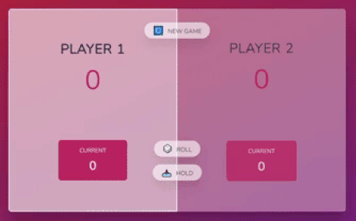
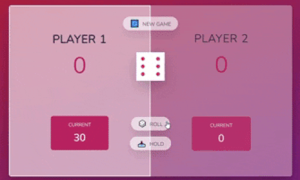
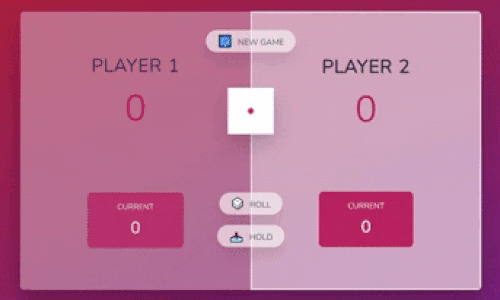
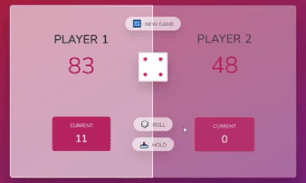
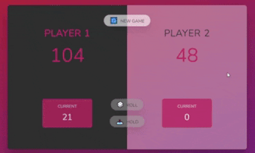

# How to Play

### Goal : The first player who reach score over a 100, Win.

1. There is 2 players who will play the game.

   - Player 1 in the left section.
   - Player 2 in the right section.

2. Player 1 will begin the game by clicking the **ROLL** button.

   

3. Players can roll the dice as many they want. The total value from the dice they rolled will be save in current score.

4. **But be careful !** When a player rolled 1, his current score will be reset back to 0 and the next player will take the turn.

   

5. Player can decide to save his current score by clicking the **HOLD** button. The score then will be save and the next player will take the turn.

   

6. Players take their turns until the first player who reach score over a 100, that player win the game!

   

7. Players can reset the game by clicking the **NEW GAME** button.

   
